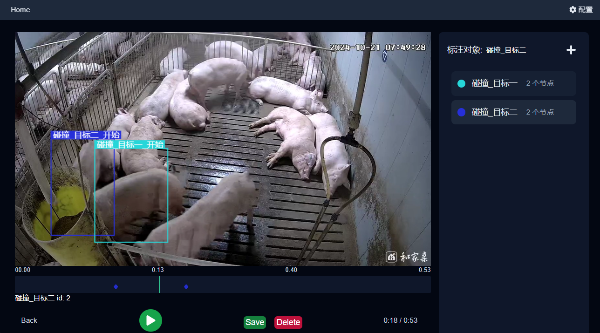

# 视频目标检测标注工具

一个简单易用的视频目标检测标注工具,可以在视频上标注目标框并保存标注信息。



## 功能特点

- 🎯 视频目标框标注
- 💾 自动保存标注数据
- 🗂️ 多级文件夹浏览
- 🎨 标签颜色自动生成
- ⌨️ 快捷键操作支持
- 🔍 标注信息预览

## 快速开始

### 1. 环境准备

请确保已安装以下软件:

- [Node.js](https://nodejs.org/en/download/prebuilt-installer) (推荐 v18 或更高版本)
- Yarn 包管理器 (通过运行 `npm install -g yarn` 安装)

### 2. 安装

1. 克隆或下载本项目
2. 运行 `install.bat` 进行依赖安装

### 3. 配置

1. 复制 `web` 目录下的 `.env.template` 文件
2. 重命名为 `.env.local`
3. 修改配置文件中的视频文件夹路径

### 4. 运行

方式一 (开发模式):
```bash
yarn dev
```

方式二 (生产模式):
```bash
yarn build  # 构建项目
yarn start  # 启动服务
```

或直接运行 `run_web.bat`

## 使用说明

1. 启动后访问 http://localhost:3353
2. 点击右上角"配置"按钮设置视频文件夹路径
3. 在文件列表中选择要标注的视频
4. 使用鼠标在视频画面上拖拽来创建标注框
5. 输入标签名称并保存

### 快捷键

- 空格键: 播放/暂停
- 左右方向键: 快进/快退

## 技术栈

- Next.js 14
- TypeScript
- TailwindCSS
- React

## 开发相关

如果你想参与开发,可以先了解以下文件结构:

```
app/
├── components/     # React组件
├── lib/           # 工具函数和类型定义  
├── service/       # API服务封装
└── (views)/       # 页面组件
```

## 许可证

MIT License
