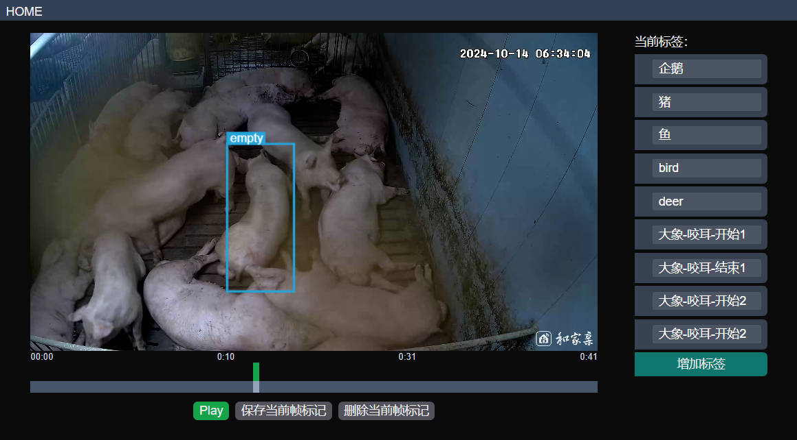

# 视频目标检测标注工具

## 1. Instalation
如果没有安装 NodeJS 和 Yarn ，请先安装。
- NodeJS: https://nodejs.org/en/download/prebuilt-installer
- Yarn: `npm install -g yarn`

运行 `install.bat`

## 2. Usage
修改 `run_server.bat` 中的文件夹路径为你的视频文件夹路径。

运行 `run_server.bat` 打开后端服务

运行 `run_web.bat` 打开前端服务

## 3. TODO
- [x] 视频路径浏览
- [x] 标注文件保存
- [x] 标注信息浏览
- [x] 删除标注
- [x] 标注框缩放拖动体验优化
- [ ] 标签管理和视频文件预览优化
